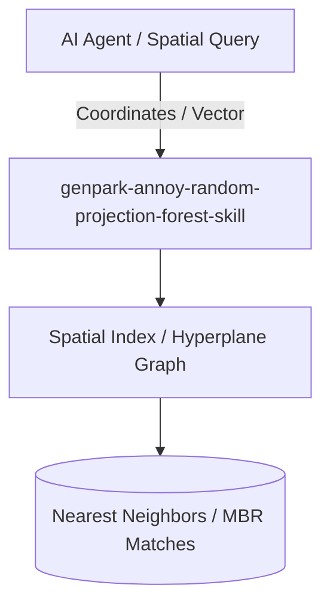

# genpark-annoy-random-projection-forest-skill

[](https://github.com/alphaparkinc/genpark-annoy-random-projection-forest-skill/actions)
[](https://opensource.org/licenses/MIT)
[](https://www.python.org/downloads/)

> Approximate Nearest Neighbors random projection forest (Annoy style) recursively partitioning space via random hyperplanes.

## Architecture



## Features
- Pure standard library Python implementation with strictly zero pip dependencies.
- Sub-linear multi-dimensional spatial and vector indexing algorithms.
- Native Model Context Protocol (MCP) server support for AI agent spatial intelligence.

## Installation

```bash
git clone https://github.com/alphaparkinc/genpark-annoy-random-projection-forest-skill.git
cd genpark-annoy-random-projection-forest-skill
```

## Quickstart

```bash
python example_usage.py
```
